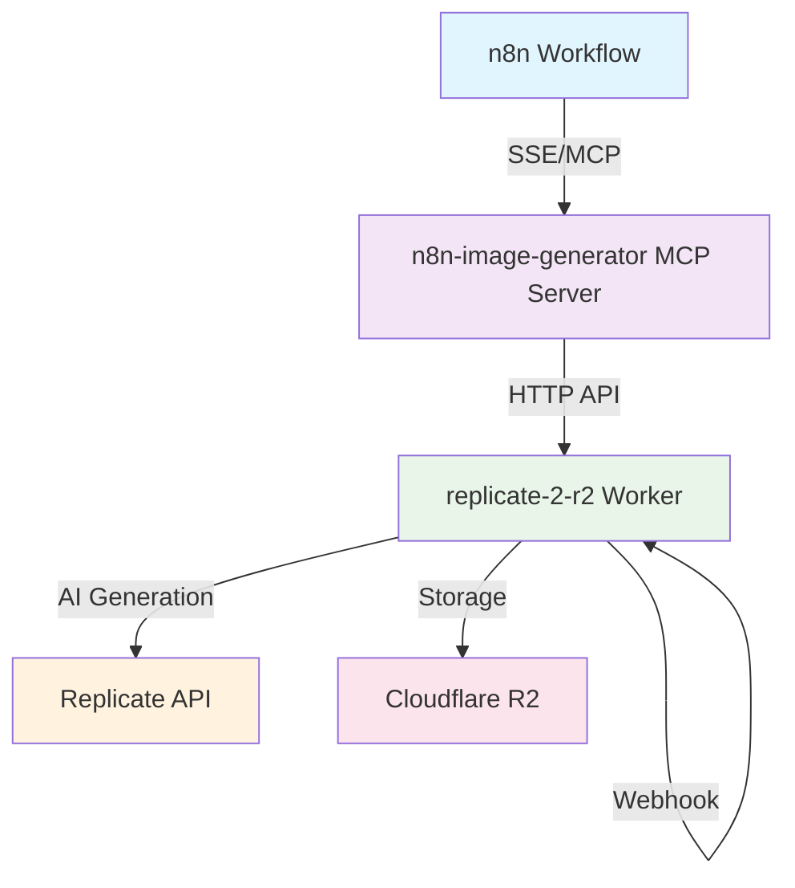

# Cloudflare Workers Collection

This repository contains a collection of specialized Cloudflare Workers and related tools, each designed to provide specific functionality and services.

## Available Projects

### [replicate-2-r2](./replicate-2-r2)
A worker that integrates Replicate's AI image generation with Cloudflare R2 storage. This worker:
- Generates images using Replicate's API
- Stores generated images in Cloudflare R2
- Provides immediate URL generation
- Supports webhook notifications
- Includes MCP server integration for seamless AI tooling

👉 [Learn more about replicate-2-r2](./replicate-2-r2)

### [generate-image](./mcps/generate-image)
A Model Context Protocol (MCP) server that provides a simple interface to the replicate-2-r2 worker. This server:
- Interfaces with replicate-2-r2 worker
- Provides type-safe API calls
- Handles asynchronous image generation
- Supports real-time status updates

👉 [Learn more about generate-image](./mcps/generate-image)

### [n8n-image-generator](./mcps/n8n-image-generator) ⭐ NEW
A specialized MCP server designed specifically for n8n integration with SSE protocol support. This server:
- **Perfect n8n Integration**: Works seamlessly with n8n's MCP Client Tool
- **SSE Protocol Support**: Real-time communication using Server-Sent Events
- **Multi-Model Support**: Supports Flux, Stable Diffusion, and more AI models
- **Production Ready**: Built with error handling and monitoring
- **Zero Worker Changes**: Uses existing replicate-2-r2 worker without modifications

👉 [Learn more about n8n-image-generator](./mcps/n8n-image-generator)

## 🚀 Quick Start for n8n Users

If you want to use AI image generation in n8n workflows, follow these steps:

### 1. Deploy the Worker
```bash
cd replicate-2-r2
npm install
npm run deploy
```

### 2. Set up the MCP Server
```bash
cd mcps/n8n-image-generator
npm install
npm run build
```

### 3. Configure Environment
```bash
export CLOUDFLARE_WORKERS_URL=https://your-worker.workers.dev
export WORKER_API_TOKEN=your-api-token
npm start
```

### 4. Add to n8n
In your n8n workflow:
1. Add **MCP Client Tool** node
2. Configure connection to your MCP server
3. Use `generate_image` tool with your prompt

## Architecture Overview



## Getting Started

Each project is contained in its own directory with its own documentation. To get started:

1. Choose the project you want to use
2. Navigate to its directory
3. Follow the setup instructions in its README.md

## Repository Structure

```
cloudflare-workers/
├── README.md
├── replicate-2-r2/         # Replicate integration worker
│   ├── README.md           # Worker-specific documentation
│   ├── src/                # Source code
│   └── ...                 # Other worker files
└── mcps/                   # MCP servers
    ├── generate-image/     # Original MCP server
    │   ├── README.md       # Server documentation
    │   ├── src/           # Source code
    │   └── ...            # Other server files
    └── n8n-image-generator/ # ⭐ NEW: n8n-specific MCP server
        ├── README.md       # Detailed setup guide
        ├── src/           # TypeScript source
        └── ...            # Configuration files
```

## 🔄 Migration from generate-image to n8n-image-generator

If you're currently using the original `generate-image` MCP server, consider migrating to `n8n-image-generator` for better n8n integration:

### Benefits of n8n-image-generator:
- ✅ **Better SSE Support**: Designed specifically for n8n's MCP Client Tool
- ✅ **Enhanced Error Handling**: More robust error messages and logging
- ✅ **Improved Performance**: Optimized for n8n workflow patterns
- ✅ **Better Documentation**: Comprehensive setup and usage guides
- ✅ **Active Development**: Focused on n8n use cases

### Migration Steps:
1. Install the new MCP server: `cd mcps/n8n-image-generator && npm install`
2. Update your n8n MCP Client Tool configuration
3. Test your workflows with the new server
4. Enjoy improved reliability and performance!

More projects will be added to this collection in the future. Stay tuned for updates!