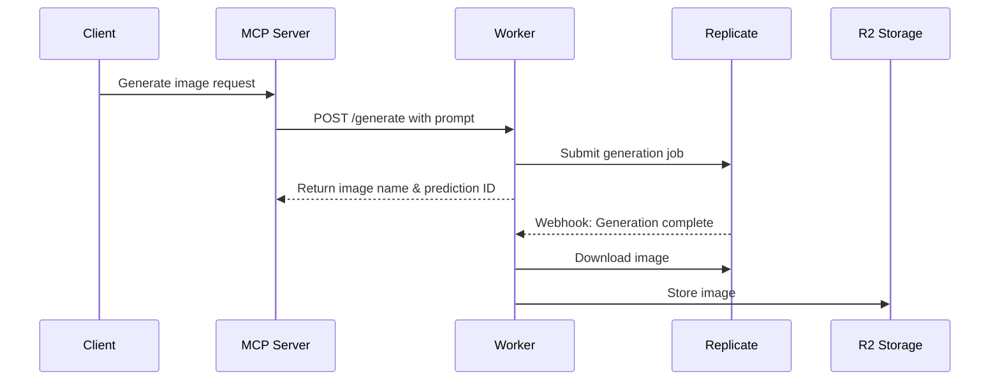

# Replicate to R2 Worker 项目详细总结

## 项目概述

**Replicate to R2 Worker** 是一个基于Cloudflare Workers的图像生成服务，它集成了Replicate AI图像生成API和Cloudflare R2存储服务。该项目的核心功能是接收图像生成请求，调用Replicate API生成图像，并将生成的图像自动存储到R2存储桶中。

## 核心架构特点

### 技术栈
- **运行环境**: Cloudflare Workers (Edge Computing)
- **开发语言**: TypeScript
- **AI服务**: Replicate API (官方SDK)
- **存储服务**: Cloudflare R2
- **包管理**: pnpm
- **构建工具**: Wrangler

### 项目结构
```
replicate-2-r2/
├── src/
│   ├── index.ts          # 主要Worker逻辑
│   ├── types.ts          # TypeScript类型定义
│   └── utils/            # 工具函数
│       ├── auth.ts       # API认证
│       ├── webhook.ts    # Webhook签名验证
│       ├── replicate.ts  # Replicate客户端
│       ├── image.ts      # 图像下载
│       └── id.ts         # 唯一ID生成
├── scripts/              # 辅助脚本
│   ├── generate-signature.js
│   └── generate-signature.ts
├── API.md               # API文档
├── README.md            # 项目说明
├── package.json         # 依赖配置
├── wrangler.toml.example # Wrangler配置示例
└── tsconfig.json        # TypeScript配置
```

## Webhook实现详解 ⭐

### 1. Webhook安全验证机制

项目实现了完整的Replicate webhook安全验证，这是最值得参考的部分：

```typescript
export async function verifyWebhookSignature(
  webhookId: string,
  webhookTimestamp: string,
  webhookSignature: string,
  body: string,
  webhookSecret: string
): Promise<boolean> {
  // 时间戳验证防止重放攻击
  const timestampNum = parseInt(webhookTimestamp, 10);
  const currentTimestamp = Math.floor(Date.now() / 1000);
  if (Math.abs(currentTimestamp - timestampNum) > MAX_TIMESTAMP_DIFF) {
    return false;
  }

  // 构建签名内容
  const signedContent = `${webhookId}.${webhookTimestamp}.${body}`;
  
  // HMAC-SHA256签名验证
  const secretKey = webhookSecret.startsWith('whsec_') 
    ? webhookSecret.slice(6) 
    : webhookSecret;
  
  const secretBytes = Uint8Array.from(atob(secretKey), c => c.charCodeAt(0));
  const signedContentBytes = encoder.encode(signedContent);
  
  const key = await crypto.subtle.importKey(
    'raw', secretBytes, { name: 'HMAC', hash: 'SHA-256' }, false, ['sign']
  );
  
  const signature = await crypto.subtle.sign('HMAC', key, signedContentBytes);
  const computedSignature = btoa(String.fromCharCode(...new Uint8Array(signature)));
  
  // 常量时间比较防止时序攻击
  return expectedSignatures.some(expectedSig => {
    // 安全的字节级比较
  });
}
```

**安全特性**:
- ✅ **时间戳验证**: 防止重放攻击，限制5分钟内的请求
- ✅ **HMAC-SHA256签名**: 使用加密哈希确保数据完整性
- ✅ **常量时间比较**: 防止时序攻击
- ✅ **多签名支持**: 支持Replicate的多签名格式
- ✅ **Base64解码处理**: 正确处理webhook secret格式

### 2. Webhook处理流程

```typescript
// 检测webhook请求
const webhookId = request.headers.get('webhook-id');
const webhookTimestamp = request.headers.get('webhook-timestamp');
const webhookSignature = request.headers.get('webhook-signature');

if (webhookId && webhookTimestamp && webhookSignature) {
  // 1. 验证签名
  const isValid = await verifyWebhookSignature(
    webhookId, webhookTimestamp, webhookSignature, rawBody, env.REPLICATE_WEBHOOK_SECRET
  );
  
  if (!isValid) {
    return new Response('Invalid webhook signature', { status: 401 });
  }

  // 2. 解析webhook数据
  const webhookData = JSON.parse(rawBody);
  
  // 3. 处理成功的预测结果
  if (webhookData.status === 'succeeded' && webhookData.output) {
    // 从元数据获取图像键
    const metadata = await env.BUCKET.get(`metadata/${predictionId}.json`);
    const { imageKey } = JSON.parse(await metadata.text());
    
    // 下载并存储图像
    const imageData = await downloadImage(webhookData.output[0]);
    await env.BUCKET.put(imageKey, imageData, {
      httpMetadata: { contentType: 'image/webp' }
    });
  }
  
  return new Response('OK', { status: 200 });
}
```

### 3. 异步处理模式

项目采用了**预分配URL + 异步填充**的模式：



**处理步骤**:
1. **立即响应**: 接收请求后立即返回预生成的图像URL
2. **异步生成**: Replicate在后台生成图像
3. **Webhook回调**: 生成完成后通过webhook通知Worker
4. **图像存储**: Worker下载图像并存储到预分配的URL位置

### 4. 元数据管理

```typescript
interface PredictionMetadata {
  predictionId: string;
  imageKey: string;
}

// 存储预测元数据
const metadata: PredictionMetadata = {
  predictionId: prediction.id,
  imageKey: `${generateUniqueId()}.webp`,
};

await env.BUCKET.put(`metadata/${prediction.id}.json`, JSON.stringify(metadata), {
  httpMetadata: { contentType: 'application/json' }
});
```

通过在R2中存储元数据，webhook处理器能够找到对应的图像存储位置。

## API接口设计

### 请求格式
```json
{
  "prompt": "A serene landscape with mountains and a lake at sunset",
  "model": "black-forest-labs/flux-schnell",
  "version": "39ed52f2a78e934b3ba6e2a89f512132de7dfea535525255b1aa35c5565e08b",
  "webhook": "https://your-app.com/webhooks/replicate",
  "webhookEvents": ["completed"]
}
```

### 响应格式
```json
{
  "id": "rf3d2d4f9",
  "imageUrl": "https://pub-fdc3b8e93c2c4481213aad475393d1ecd.r2.dev/blog/1708840000000-ab1cd2.png",
  "status": "processing"
}
```

## 环境配置与部署

### 1. 环境变量管理
```bash
# 开发环境 (.dev.vars)
WORKER_API_TOKEN=your_dev_token_here
REPLICATE_API_TOKEN=your_replicate_dev_token_here
REPLICATE_WEBHOOK_SECRET=your_webhook_secret_here
BUCKET_URL=your_dev_bucket_url_here

# 生产环境 (wrangler secrets)
wrangler secret put WORKER_API_TOKEN
wrangler secret put REPLICATE_API_TOKEN
wrangler secret put REPLICATE_WEBHOOK_SECRET
```

### 2. R2存储配置
```toml
# wrangler.toml
[[r2_buckets]]
binding = "BUCKET"
bucket_name = "YOUR_BUCKET_NAME"
preview_bucket_name = "YOUR_PREVIEW_BUCKET_NAME"

[vars]
BUCKET_URL = "YOUR_BUCKET_URL"
```

**R2 URL结构**:
```
https://pub-{hash}.r2.dev/{bucket-name}/{file-name}
```

### 3. 开发模式
```bash
# 远程开发 (推荐)
npm run dev

# 本地开发
npm run dev:local

# 生产部署
npm run deploy
```

## MCP集成设计

### 认证机制
- Worker API Token用于MCP服务器认证
- 支持Bearer Token格式

### 配置示例
```json
{
  "mcpServers": {
    "generate-image": {
      "command": "node",
      "args": ["PATH_TO_YOUR_GENERATE_IMAGE_SERVER"],
      "env": {
        "WORKER_API_TOKEN": "YOUR_WORKER_API_TOKEN",
        "CLOUDFLARE_WORKERS_URL": "YOUR_WORKER_URL"
      }
    }
  }
}
```

## 错误处理与监控

### 全面的错误处理
- ❌ API认证失败 → 401 Unauthorized
- ❌ Replicate API错误 → 500 Internal Server Error
- ❌ 图像下载失败 → 500 Internal Server Error
- ❌ R2存储错误 → 500 Internal Server Error
- ❌ Webhook验证失败 → 401 Invalid webhook signature

### 日志记录
```typescript
console.log('Received webhook:', { webhookId, webhookTimestamp });
console.log('Webhook data:', webhookData);
console.log('Downloading image from:', webhookData.output[0]);
console.log('Image downloaded, size:', imageData.byteLength);
console.log('Image stored in R2:', `${env.BUCKET_URL}/${imageKey}`);
```

## 项目亮点

### 1. 安全性 🔒
- ✅ 完整的webhook签名验证
- ✅ 时间戳防重放攻击
- ✅ 安全的API token认证
- ✅ CORS支持

### 2. 可扩展性 📈
- ✅ 模块化的工具函数设计
- ✅ TypeScript类型安全
- ✅ 清晰的接口定义
- ✅ 官方Replicate SDK集成

### 3. 开发体验 🛠️
- ✅ 完整的开发/生产环境分离
- ✅ 详细的文档和示例
- ✅ 便于测试的脚本工具
- ✅ 热重载开发模式

### 4. 性能优化 ⚡
- ✅ Edge Computing部署
- ✅ 异步处理模式
- ✅ 预分配URL减少延迟
- ✅ R2存储优化

## 建议改进方向

### 当前实现特点
- ✅ 返回图像名称立即响应，提供快速客户端反馈
- ✅ 基于可预测命名模式创建R2文件
- ⚠️ 客户端需要轮询或实现webhook处理获取最终图像
- ⚠️ 无法保证客户端接收到最终图像URL

### 建议的改进
考虑实现基于webhook的方法：
1. Worker等待Replicate完成
2. 将图像存储在R2中
3. 回调MCP服务器提供最终URL
4. MCP服务器用永久URL更新客户端

**优势**:
- 更可靠的图像交付确认
- 保证向客户端交付最终URL
- 更好的错误处理能力
- 降低客户端复杂性

## 总结

这个项目是一个优秀的Cloudflare Workers + AI服务集成的参考实现，特别是其**webhook安全验证**和**异步处理模式**值得在类似项目中借鉴。项目展示了如何在边缘计算环境中构建安全、可扩展的AI服务集成方案。
