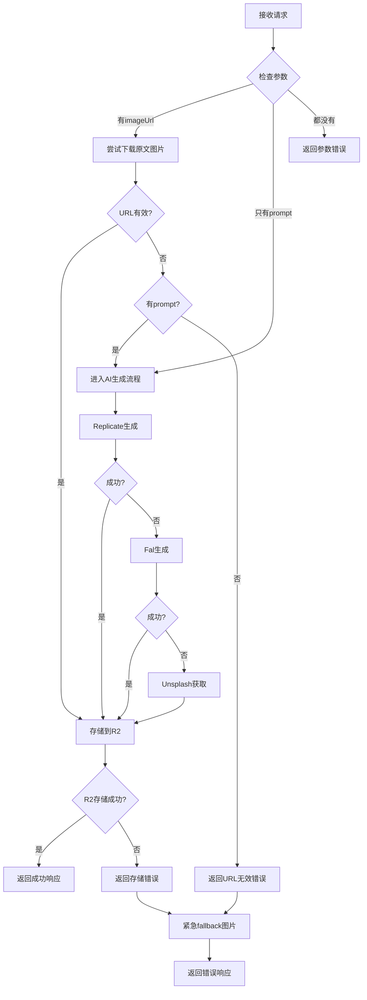

# 统一图片处理API设计文档

## 概述

设计一个统一的图片处理接口，支持两种模式：
1. **原文URL图片下载** → 存储到R2 → 返回R2地址
2. **AI图片生成** → 存储到R2 → 返回R2地址（原有三级fallback机制）

## API接口设计

### 请求接口

**端点**: `POST /images/generate`

**请求体**:
```typescript
interface UnifiedImageRequest {
  // 新增：原文图片URL（可选）
  imageUrl?: string;
  
  // 原有：AI生成提示词（当imageUrl无效时必需）
  prompt?: string;
  
  // 原有：可选参数
  provider?: 'replicate' | 'fal' | 'unsplash';
  articleId?: string;
  keyword?: string;
  width?: number;
  height?: number;
  style?: string;
}
```

**参数验证规则**:
- `imageUrl` 和 `prompt` 至少提供一个
- 如果只提供 `imageUrl`，则尝试下载原文图片
- 如果只提供 `prompt`，则使用AI生成
- 如果两者都提供，优先尝试 `imageUrl`，失败后使用 `prompt` 生成

### 响应接口

**成功响应**:
```typescript
interface UnifiedImageResponse {
  // 统一返回R2存储的URL
  url: string;
  
  // 图片来源标识
  source: 'original' | 'replicate' | 'fal' | 'unsplash' | 'emergency-fallback';
  
  // 处理时间
  elapsedMs: number;
  
  // 成功标识
  success: true;
  
  // R2存储状态
  r2Stored: true;
  
  // 可选：原始URL（当source为'original'时）
  originalUrl?: string;
  
  // 可选：使用的提示词（当source为AI生成时）
  usedPrompt?: string;
}
```

**错误响应**:
```typescript
interface UnifiedImageErrorResponse {
  // 降级后的图片URL（确保始终有可用图片）
  url: string;
  
  // 错误来源
  source: 'emergency-fallback';
  
  // 处理时间
  elapsedMs: number;
  
  // 失败标识
  success: false;
  
  // 错误信息
  error: string;
  
  // 详细错误信息
  details?: {
    originalUrlError?: string;
    aiGenerationError?: string;
    r2StorageError?: string;
  };
}
```

## 处理流程设计

### 主流程



### URL有效性检测逻辑

```typescript
interface UrlValidationResult {
  isValid: boolean;
  error?: string;
  contentType?: string;
  contentLength?: number;
}

async function validateImageUrl(url: string): Promise<UrlValidationResult> {
  try {
    // 1. URL格式检查
    const urlObj = new URL(url);
    if (!['http:', 'https:'].includes(urlObj.protocol)) {
      return { isValid: false, error: 'Invalid protocol' };
    }
    
    // 2. HEAD请求检查
    const response = await fetch(url, { 
      method: 'HEAD',
      headers: { 'User-Agent': 'CloudflareWorker/1.0' }
    });
    
    if (!response.ok) {
      return { isValid: false, error: `HTTP ${response.status}` };
    }
    
    // 3. Content-Type检查
    const contentType = response.headers.get('content-type');
    const validTypes = [
      'image/jpeg', 'image/jpg', 'image/png', 'image/webp', 
      'image/gif', 'image/svg+xml', 'image/bmp'
    ];
    
    if (!contentType || !validTypes.some(type => contentType.includes(type))) {
      return { isValid: false, error: 'Invalid content type' };
    }
    
    // 4. 文件大小检查（可选）
    const contentLength = response.headers.get('content-length');
    const maxSize = 10 * 1024 * 1024; // 10MB
    if (contentLength && parseInt(contentLength) > maxSize) {
      return { isValid: false, error: 'File too large' };
    }
    
    return { 
      isValid: true, 
      contentType,
      contentLength: contentLength ? parseInt(contentLength) : undefined
    };
  } catch (error) {
    return { 
      isValid: false, 
      error: error instanceof Error ? error.message : 'Unknown error' 
    };
  }
}
```

## 向后兼容性

### 现有调用方式保持不变
```javascript
// 原有调用方式继续有效
const response = await fetch('/images/generate', {
  method: 'POST',
  headers: { 'Content-Type': 'application/json' },
  body: JSON.stringify({
    prompt: "A beautiful sunset",
    articleId: "article-123"
  })
});
```

### 新的调用方式
```javascript
// 新方式1：只下载原文图片
const response1 = await fetch('/images/generate', {
  method: 'POST',
  headers: { 'Content-Type': 'application/json' },
  body: JSON.stringify({
    imageUrl: "https://example.com/image.jpg",
    articleId: "article-123"
  })
});

// 新方式2：原文图片 + AI生成备选
const response2 = await fetch('/images/generate', {
  method: 'POST',
  headers: { 'Content-Type': 'application/json' },
  body: JSON.stringify({
    imageUrl: "https://example.com/image.jpg",
    prompt: "A beautiful sunset",
    articleId: "article-123"
  })
});
```

## 错误处理策略

### 1. 渐进式降级
- 原文URL失败 → AI生成
- AI生成失败 → 紧急fallback图片

### 2. 详细错误信息
- 记录每个步骤的失败原因
- 提供调试信息但不暴露敏感数据

### 3. 确保可用性
- 无论何种情况，都返回可用的图片URL
- 优先返回R2存储的永久链接

## 配置选项

```typescript
interface UnifiedImageConfig {
  // URL验证配置
  urlValidation: {
    timeout: number;           // 验证超时时间
    maxFileSize: number;       // 最大文件大小
    allowedTypes: string[];    // 允许的MIME类型
    userAgent: string;         // 请求User-Agent
  };
  
  // 下载配置
  download: {
    timeout: number;           // 下载超时时间
    retries: number;           // 重试次数
    retryDelay: number;        // 重试延迟
  };
  
  // AI生成配置（继承现有配置）
  aiGeneration: {
    // ... 现有AI配置
  };
}
```

## 监控和日志

### 关键指标
- 原文URL成功率
- AI生成成功率  
- R2存储成功率
- 平均响应时间
- 错误分布

### 日志格式
```typescript
interface ProcessingLog {
  requestId: string;
  timestamp: string;
  imageUrl?: string;
  prompt?: string;
  articleId?: string;
  steps: Array<{
    step: 'url_validation' | 'url_download' | 'ai_generation' | 'r2_storage';
    status: 'success' | 'failure';
    duration: number;
    error?: string;
  }>;
  finalResult: {
    source: string;
    url: string;
    success: boolean;
  };
}
```
