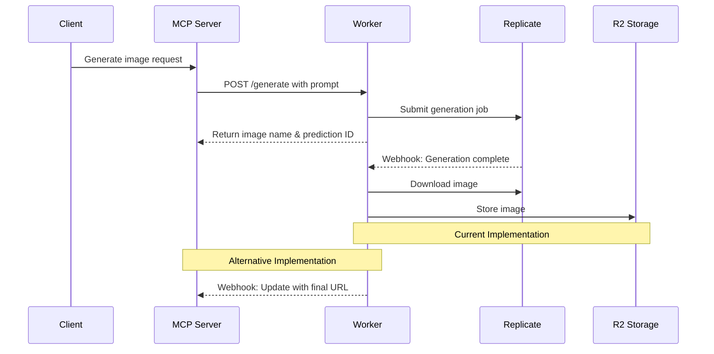

# Replicate to R2 Worker

A Cloudflare Worker that generates images using Replicate's API and stores them in Cloudflare R2. Built using the official Replicate client library.

## Features

- Worker API token authentication for MCP access
- Immediate unique URL generation for image placeholders
- Official Replicate SDK integration with type safety
- Standard model identification format
- Asynchronous image generation and R2 storage
- Comprehensive webhook support
- CORS support for browser access

## Documentation

For detailed API documentation including request/response formats and examples, see [API Documentation](API.md).

## MCP Integration

### Flow Diagram



### MCP Server Configuration

Add the following configuration to your MCP settings file (`cline_mcp_settings.json`):

```json
{
  "mcpServers": {
    "generate-image": {
      "command": "node",
      "args": [
        "PATH_TO_YOUR_GENERATE_IMAGE_SERVER"
      ],
      "env": {
        "WORKER_API_TOKEN": "YOUR_WORKER_API_TOKEN",
        "CLOUDFLARE_WORKERS_URL": "YOUR_WORKER_URL"
      },
      "disabled": false,
      "alwaysAllow": []
    }
  }
}
```

Make sure to replace:
- `PATH_TO_YOUR_GENERATE_IMAGE_SERVER`: Path to your generate-image server JavaScript file
- `YOUR_WORKER_API_TOKEN`: Your Cloudflare worker API token
- `YOUR_WORKER_URL`: Your Cloudflare worker URL

### MCP Server Example

```typescript
import { McpServer } from '@modelcontextprotocol/sdk/server/mcp.js';
import { StdioServerTransport } from '@modelcontextprotocol/sdk/server/stdio.js';
import { z } from 'zod';

// Initialize the server
const server = new McpServer({
    name: 'YOUR_SERVER_NAME',
    version: 'YOUR_VERSION',
});

// Basic tool registration
server.tool(
    'generate',
    'Generate image using Flux model',
    {
        prompt: z.string().describe('The prompt for the image'),
    },
    async ({ prompt }) => {
        try {
            const timestamp = Date.now();
            const slug = `img-${timestamp}`;

            // Call the Worker API
            const workerResponse = await fetch(`${process.env.CLOUDFLARE_WORKERS_URL}`, {
                method: 'POST',
                headers: {
                    'Content-Type': 'application/json',
                    'Authorization': `Bearer ${process.env.WORKER_API_TOKEN}`,
                },
                body: JSON.stringify({
                    prompt: prompt,
                    model: "YOUR_MODEL_NAME",
                    webhook: `${process.env.CLOUDFLARE_WORKERS_URL}`,
                    webhookEvents: ["completed"]
                })
            });

            if (!workerResponse.ok) {
                const error = await workerResponse.json();
                throw new Error(error.error || 'Worker API error');
            }

            const result = await workerResponse.json();

            // Return the result
            return {
                content: [{
                    type: 'text' as const,
                    text: `Generation started!\nPrediction ID: ${result.id}\nImage URL: ${result.imageUrl}\nStatus: ${result.status}`
                }]
            };
        } catch (error) {
            console.error('Error:', error);
            throw error;
        }
    }
);

// Start the server
const transport = new StdioServerTransport();
server.connect(transport).catch(error => {
    console.error('Server error:', error);
    process.exit(1);
});
```

### Implementation Notes

The current implementation has the following characteristics:

**Current Approach:**
- ✅ Returns image name immediately, enabling quick client feedback
- ✅ Creates R2 file based on predictable naming pattern
- ⚠️ Client needs to poll or implement webhook handling for final image
- ⚠️ No guarantee that client receives final image URL

**Suggested Improvement:**
Consider implementing a webhook-based approach where:
1. Worker waits for Replicate completion
2. Stores image in R2
3. Calls back to MCP server with final URL
4. MCP server updates client with permanent URL

This would provide:
- More reliable image delivery confirmation
- Guaranteed final URL delivery to client
- Better error handling capabilities
- Reduced client complexity

## Setup

1. Install dependencies:
```bash
npm install
```

2. Configure R2:
   - In the Cloudflare dashboard, go to R2 > Buckets
   - Create two buckets:
     - Production bucket
     - Development bucket
   - For each bucket:
     - Click on "Settings"
     - Under "Public Access", create a public bucket URL
     - Copy the public bucket URL base (looks like `https://pub-{hash}.r2.dev`)

3. Configure Production Environment:
   Create a `wrangler.toml` file based on `wrangler.toml.example`:
   ```toml
   [[r2_buckets]]
   binding = "BUCKET"
   bucket_name = "YOUR_BUCKET_NAME"
   preview_bucket_name = "YOUR_PREVIEW_BUCKET_NAME"

   [vars]
   BUCKET_URL = "YOUR_BUCKET_URL"
   ```

4. Configure Development Environment:
   Create a `.dev.vars` file in the project root:
   ```
   WORKER_API_TOKEN=your_dev_token_here
   REPLICATE_API_TOKEN=your_replicate_dev_token_here
   REPLICATE_WEBHOOK_SECRET=your_webhook_secret_here
   BUCKET_URL=your_dev_bucket_url_here
   ```
   Note: 
   - `.dev.vars` is automatically ignored by git for security
   - Variables in `.dev.vars` take precedence during local development

5. For production deployment, set up required secrets:
```bash
wrangler secret put WORKER_API_TOKEN
wrangler secret put REPLICATE_API_TOKEN
wrangler secret put REPLICATE_WEBHOOK_SECRET
```

## Development

The worker supports two development modes:

### Remote Development (Recommended)
Uses the actual R2 bucket for storage, best for testing with real data:
```bash
npm run dev
```

This will:
- Use your remote R2 bucket for storage
- Connect to real Replicate API
- Enable testing with actual webhooks
- Store images in the development R2 bucket

### Local Development
Uses local storage simulation, good for offline development:
```bash
npm run dev:local
```

This will:
- Simulate R2 storage locally (stored in `.wrangler/state/v3/r2/`)
- Connect to real Replicate API
- May have limitations with webhook testing
- No actual R2 storage costs

For production deployment:
```bash
npm run deploy
```

Type checking:
```bash
npm run type-check
```

## Environment Variables

### Development (.dev.vars)
All development environment variables should be defined in `.dev.vars`:
```
WORKER_API_TOKEN=your_dev_token_here
REPLICATE_API_TOKEN=your_replicate_dev_token_here
REPLICATE_WEBHOOK_SECRET=your_webhook_secret_here
BUCKET_URL=your_dev_bucket_url_here
```

### Production (wrangler.toml + secrets)
Production uses a combination of wrangler.toml variables and secrets:
```toml
# wrangler.toml
[vars]
BUCKET_URL = "YOUR_BUCKET_URL"
```
```bash
# Secrets (set via wrangler secret put)
WORKER_API_TOKEN
REPLICATE_API_TOKEN
REPLICATE_WEBHOOK_SECRET
```

## Local Storage
When using `npm run dev:local`, the worker simulates R2 storage using local SQLite files:
- Located in `.wrangler/state/v3/r2/`
- Not meant for production use
- Useful for offline development
- Data persists between development sessions

## R2 URL Structure

The R2 URLs are constructed as follows:
```
https://pub-{hash}.r2.dev/{bucket-name}/{file-name}
```
Where:
- `{hash}` is your R2 public URL identifier
- `{bucket-name}` is either your production or development bucket name
- `{file-name}` is the generated image filename

For example:
- Production: `https://pub-{hash}.r2.dev/{bucket-name}/image.png`
- Development: `https://pub-{hash}.r2.dev/{preview-bucket-name}/image.png`

## Technical Implementation

- Uses the official Replicate SDK with built-in TypeScript support
- Standard model identification
- Implements proper prediction lifecycle management
- Supports webhook integration for status updates
- Handles asynchronous image storage in R2
- Secure webhook signature verification

## Error Handling

The worker includes comprehensive error handling for:
- Invalid authentication
- Missing required fields
- Replicate API errors
- Image download failures
- R2 storage issues
- Webhook delivery failures
- Invalid webhook signatures

## Example Usage

Basic request:
```json
{
  "prompt": "Your image description",
  "model": "YOUR_MODEL_NAME"
}
```

See [API Documentation](API.md) for more detailed examples and webhook integration.
